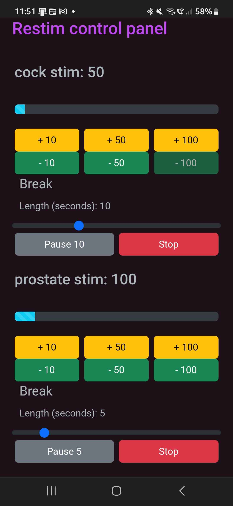

# restim-controller
 simple webui to control volume of multiple instances of restim


Setup:
make folder for each instance of restim you want to run (I run 2, "cock" and "prostate").

Copy restim into it, with its ini file, rename restim.exe to unique name (i.e. restim-penis.exe, and restim-prostate.exe), open it, configure proper output device (sound card).
This type of volume control per session works for me using Windows WASAPI audio api (first dropdown in restim)

In appsettings.json configure following:

replace "secret to login" with what you want to use to access UI (very simple access control to prevent someone using it accidentally)
    "AuthKey": "secret to login", 

For each element in AudioSessions array, configure Id (name of restim exe file, without .exe extension), DeviceName is windows audio device name (from i.e. control panel => sound => devices), Name is what is shown in UI, MaxVolume is amount to which is possible to set the volume for the restim session (0.00 - 1.00, this service does not change sound card's device volume, so you can leave that at some % you use as your absolute maximum, this will only change volume of the restim session on that device), MaxPain is additional volume for which is possible to make spikes/slaps (i.e. 0.3 if the MaxVolume is 0.7, so that it can't go over 1.00). When at 0 it will be disabled.

```json
"AudioSessions": [
      {
        "Id": "restim-penis",
        "DeviceName": "Speakers (6- USB Audio CODEC )",
        "Name": "cock",
        "MaxVolume": 0.7,
        "MaxPain": 0
      },
      {
        "Id": "restim-prostate",
        "DeviceName": "Speakers (5- USB Audio CODEC )",
        "Name": "prostate",
        "MaxVolume": 0.8,
        "MaxPain": 0
      }
    ]

```

  Also, note that the devices will appear in UI only once you "start" the restim (since it cannot find/access windows audio session while restim has not yet started using the device)
  
  