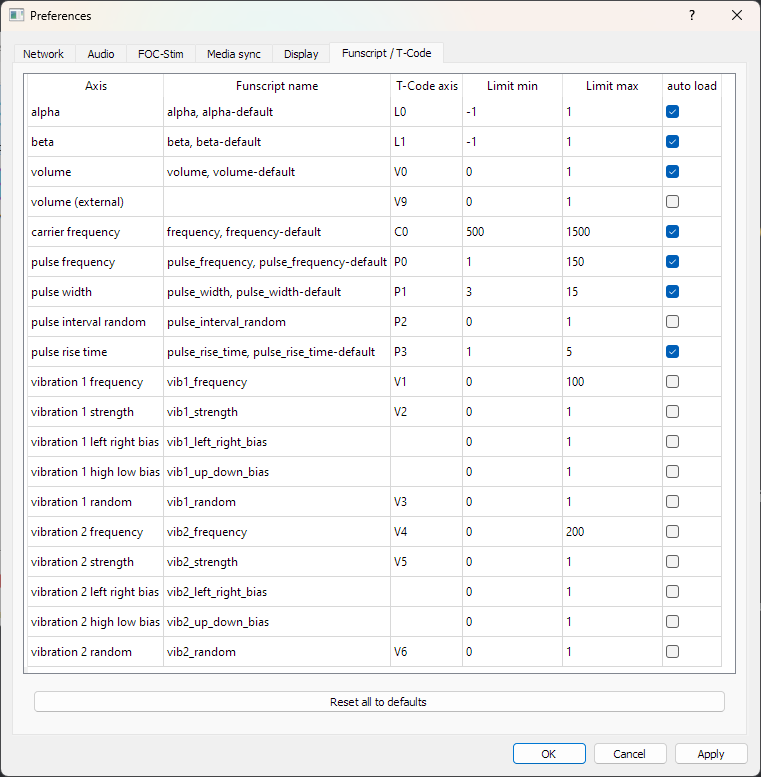

# restim-controller
 Webui to control volume of one or more instances of restim.

To download - click "Releases" on the right and download release for your PC (if you have .net framework installed minimal works on windows, otherwise download the full one)

Setup:
Make a folder for each instance of restim you want to run (I run 2, "cock" and "prostate").

Copy restim into it, with its ini file, open it, configure proper output device (sound card, or foc device, whatever you are using).
In this branch (new version) of this software, the volume control is done directly on restim volume, so it should work on any platform/OS.

In appsettings.json configure following:

replace "secret to login" with what you want to use to access UI (very simple access control to prevent someone using it accidentally)
```json
    "AuthKey": "secret to login", 
```

Go through RestimInstances array and compare settings with yours. If you are using 2, first set Enabled to true for both and make sure ports are configured properly.


| Setting | Explanation |
| ------- | ----------- |
| Id   | unique name for each instance |
| Host | ip address or hostname of computer where you are running restim (localhost usually) |
| Port | port configured in restim  Tools -> Preferences -> Network -> TCP Server and UDP Server (please enable) |
| Name | Text that appears in UI to refer to instance (title) |
| MasterVolumeTCodeAxis | T-Code axis configured for **volume (external)** axis in restim Tools -> Preferences -> Funscript / T-Code |
| Volume | Initial value of 'external' volume axis |
| MaxVolume | The max value you can set for external volume axis in this UI |
| MaxSpike | The max intensity of spikes you can make from UI (not implemented yet, so leave at 0 for now) | 
| Axes | Array of axes that you can control from the app. They should all correspond to axes in restim. |

Axes allow you to either oscillate them automatically (alpha and beta are configured like that) by having Frequency, FrequencyMin and FrequencyMax configured, it will oscillate between ValueMin and ValueMax in sinusoidal shape over time.
Offset is portion of second by which the axis is offset (basically phase shift). Configured values allow the point in restim to move in a circle by default.

Other axes have linear value (as indicated by no frequency values configured) and they appear as a slider that directly sets the value of the axis. 

**IMPORTANT**: You need to set the T-Code axis for **volume (external)** since is empty by default, and as of now the puse rise time is also empty by default. For each axis in config file (aside from alpha/beta since they are oscillating), make sure you set correct T-Code axis, ValueMin and ValueMax to the same values as configured Limit Min and Limit Max in restim. 

You can compare my restim settings with the config below for your reference:




Example config:

```json
        "Enabled": true,
        "Id": "restim-penis",
        "Host": "localhost",
        "Port": 12347,
        "Name": "cock",
        "MasterVolumeTCodeAxis": "V9",
        "Volume": 0.3,
        "MaxVolume": 0.7,
        "MaxSpike": 0,
        "Axes": [
          {
            "Name": "alpha",
            "TCodeAxis": "L0",
            "ValueMin": 0,
            "ValueMax": 0.998,
            "Frequency": 2,
            "FrequencyMin":0.05,
            "FrequencyMax": 10,
            "FrequencyStep": 0.05,
            "Offset": 0,
            "Step": 0.1
          },
          {
            "Name": "beta",
            "TCodeAxis": "L1",
            "ValueMin": 0,
            "ValueMax": 0.998,
            "Frequency": 2,
            "FrequencyMin":0.05,
            "FrequencyMax": 10,
            "FrequencyStep": 0.05,
            "Offset": 0.125
          },
          {
            "Name": "volume",
            "TCodeAxis": "V0",
            "ValueMin": 0,
            "ValueMax": 0.998,
            "Value": 0.1,
            "Step": 0.01
          },
          {
            "Name": "carrier frequency",
            "TCodeAxis": "C0",
            "ValueMin": 500,
            "ValueMax": 1500,
            "Value": 1000,
            "Step": 1
          },
          {
            "Name": "pulse frequency",
            "TCodeAxis": "P0",
            "ValueMin": 1,
            "ValueMax": 150,
            "Value": 80,
            "Step": 1
          },
          {
            "Name": "pulse width",
            "TCodeAxis": "P1",
            "ValueMin": 3,
            "ValueMax": 15,
            "Value": 3,
            "Step": 1
          },
          {
            "Name": "pulse rise time",
            "TCodeAxis": "P3",
            "ValueMin": 1,
            "ValueMax": 5,
            "Value": 3,
            "Step": 0.1
          }

```

  Also, note that the restim instances will appear in UI only once you "start" the restim (it will show error that it can't connect while it is not running).


  When you run the Restim-Controller.exe it will start the web server at configured port (by default 5000), so open http://localhost:5000 in your browser, and when you run correctly configured restim, you will see the UI:
  
